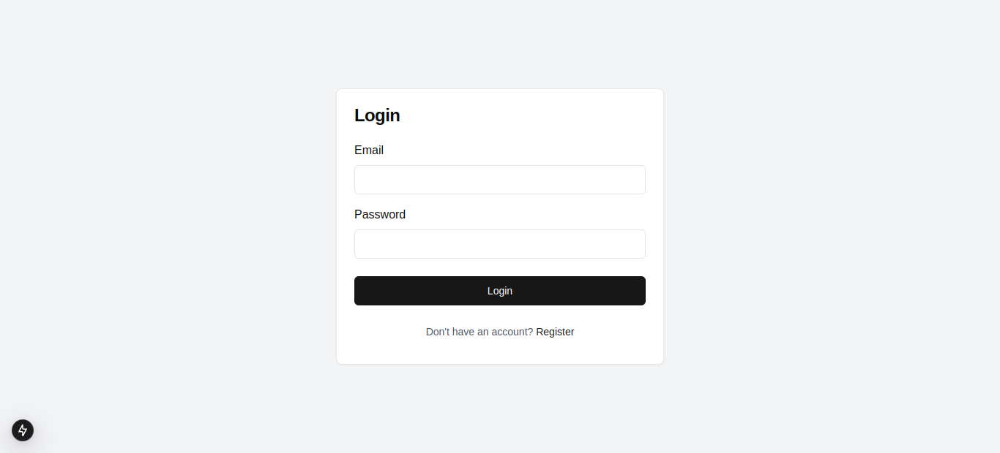
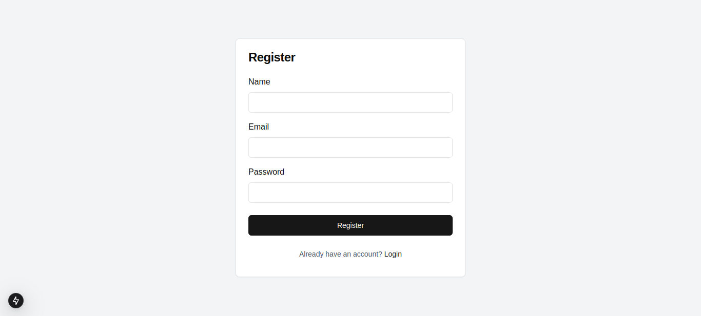
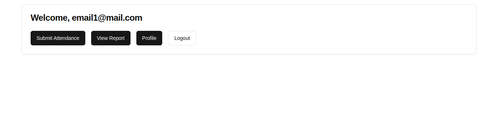
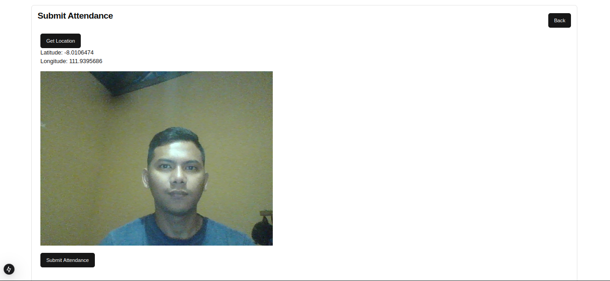
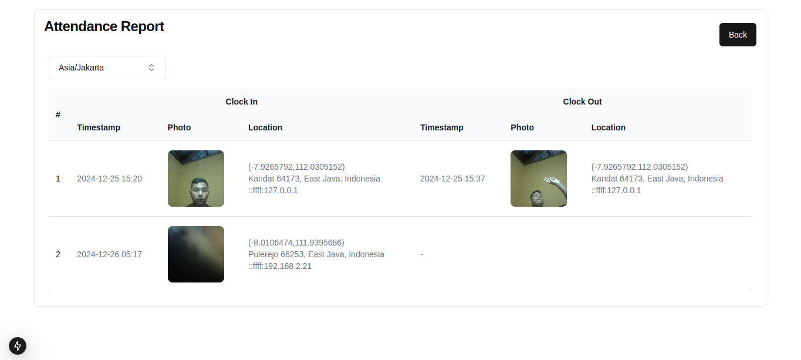
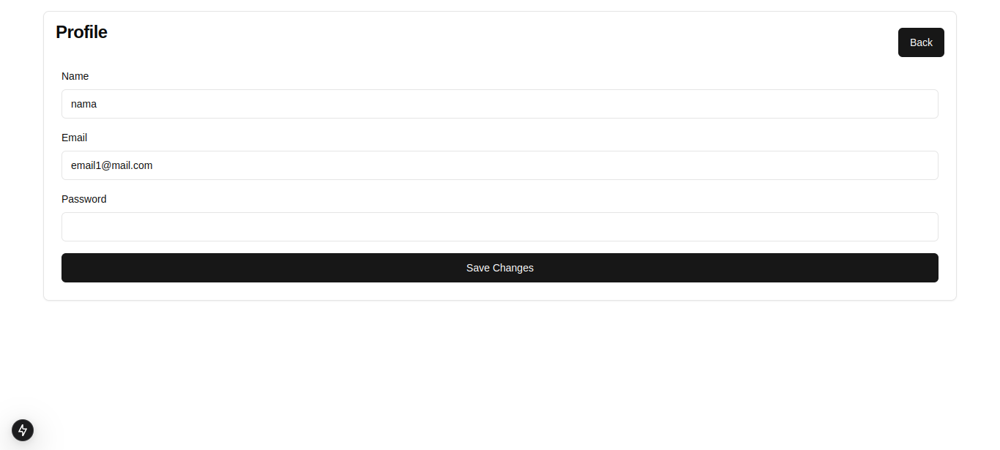

# Full-Stack Attendance System For Technical Test Coding Collective

A web-based attendance system built with Next.js frontend and Express.js backend that captures photos and location data for attendance tracking.

## Project Structure

```
technical-test-coding-collective/
├── frontend/               
├── backend/              
```

## Development

### Backend Development
- Express.js
- Multer for file uploads
- Cors for cross-origin requests
- Environment variables for configuration
- Bcrpyt for encryption
- JWT for authentication
- Sequelize ORM


### Frontend Development
- Next.js for React framework
- shadcn/ui for UI components
- Fetch API for backend communication
- Environment variables for API configuration

## Installation

1. Clone the repository:
```bash
git clone https://github.com/rizkidwik/technical-test-coding-collective.git
cd technical-test-coding-collective
```

2. Install frontend dependencies:
```bash
cd frontend
npm install
npx shadcn-ui@latest add button card command dialog input popover select
```

3. Install backend dependencies:
```bash
cd backend
npm install
```

## Environment Variables

### Frontend (.env.local)
```
cp .example.env .env.local
```
Adjust with your configuration 

### Backend (.env)
```
cp .example.env .env
```
Adjust with your configuration 

## Running the Application

1. Start the backend server:
```bash
cd backend
npm run dev
```

2. In a new terminal, start the frontend development server:
```bash
cd frontend
npm run dev
```

3. Access the application at `http://localhost:3000`

## Auto Attendance With Playwright
- Playwright for automated browser
- node-cron for auto scheduling

## Screenshots
### Login


### Register


### Dashboard


### Submit Attendance


### Report


### Edit Profile
